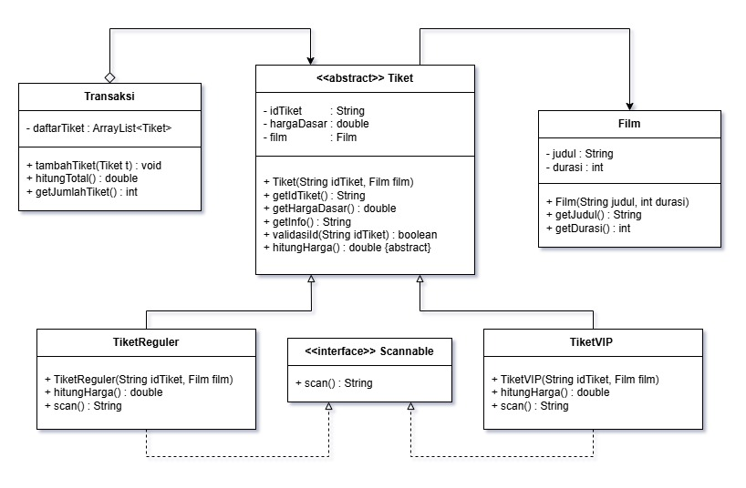

<h1 style="text-align: center;">UTS - Ticketing Bioskop</h1>

    

        <h2>Diagram</h2>
        
    

<h2>Penjelasan Class & Function</h2>

<h3>1. Class Film</h3>

Merepresentasikan data film yang ditonton.

<ul>
    <li><b>Film(String judul, int durasi)</b> 
        Constructor untuk membuat objek film dengan judul dan durasi tertentu.
    </li>
    <li><b>getJudul()</b> 
        Mengembalikan judul film.
    </li>
    <li><b>getDurasi()</b> 
        Mengembalikan durasi film dalam bentuk menit.
    </li>
</ul>

<h3>2. Abstract Class Tiket</h3>

Class dasar (parent class) untuk semua jenis tiket.
Berisi atribut umum dan method yang wajib dimiliki semua turunan tiket.

<ul>
    <li><b>Tiket(String idTiket, Film film)</b> 
        Constructor untuk menginisialisasi ID tiket dan Film. Tambahkan juga kondisi yang dapat mengatur hargaDasar. Ikuti ketentuan ini:
         
        - Film "Merah Putih One For All" memiliki harga Rp80.000  
        - Film "Demon Slayer: Infinity Castle" memiliki harga Rp50.000  
        - Film "Spider-Man No Way Home" memiliki harga Rp55.000
         
        Jangan lupa juga untuk memanggil method validasiId(String idTiket) di sini. Jika ID Tiket tidak valid, maka keluarkan output : "Format ID tiket tidak valid!".
         
        <i>Tips: Gunakan throw new IllegalArgumentException("Pesan")</i>
    </li>
    <li><b>getIdTiket()</b> 
        Mengembalikan ID tiket.
    </li>
    <li><b>getHargaDasar()</b> 
        Mengembalikan harga dasar tiket.
    </li>
    <li><b>getInfo()</b> 
        Mengembalikan informasi lengkap tiket (ID, Film, Harga).
    </li>
    <li><b>validasiId(String idTiket)</b> 
        Memvalidasi apakah ID tiket sesuai dengan format berikut:
         
        - Film "Merah Putih One For All" memiliki format MOFA-YYYY-XXXX <i>(Contoh: MOFA-2026-0001)</i>  
        - Film "Demon Slayer: Infinity Castle" format DSIC-YYYY-XXXX <i>(Contoh: DSIC-2026-0001)</i>  
        - Film "Spider-Man No Way Home" memiliki format SNWH-YYYY-XXXX <i>(Contoh: SNWH-2026-0001)</i>
         
        <i>Tips: Gunakan Pattern.matches()</i>
    </li>
    <li><b>hitungHarga()</b> (abstract) 
        Method abstrak untuk menghitung harga akhir tiket.
        Wajib diimplementasikan oleh subclass.
    </li>
</ul>

<h3>3. Class TiketReguler</h3>

Subclass dari Tiket yang merepresentasikan tiket reguler.

<ul>
    <li><b>TiketReguler(String idTiket, Film film)</b> 
        Constructor untuk menginisialisasi ID tiket dan Film.
    </li>
    <li><b>hitungHarga()</b> 
        Menghitung harga tiket reguler (sama dengan harga dasar).
    </li>
    <li><b>scan()</b> 
        Mengembalikan pesan hasil pemindaian tiket reguler. Formatnya : "Tiket Reguler (idTiket) berhasil discan"
    </li>
</ul>

<h3>4. Class TiketVIP</h3>

Subclass dari Tiket yang merepresentasikan tiket VIP. Memiliki tambahan biaya dari harga dasar.

<ul>
    <li><b>TiketVIP(String idTiket, Film film)</b> 
        Constructor untuk menginisialisasi ID tiket dan Film.
    </li>
    <li><b>hitungHarga()</b> 
        Menghitung harga tiket VIP (naik 25% dari harga dasar).
    </li>
    <li><b>scan()</b> 
        Mengembalikan pesan hasil pemindaian tiket VIP. Formatnya : "Tiket VIP (idTiket) berhasil discan"
    </li>
</ul>

<h3>5. Interface Scannable</h3>

Interface yang mewajibkan class implementasinya memiliki method scan().

<ul>
    <li><b>scan()</b> 
        Digunakan untuk mensimulasikan proses pemindaian tiket.
    </li>
</ul>

<h3>6. Class Transaksi</h3>

Class yang menangani kumpulan tiket dalam satu transaksi pembelian.

<ul>
    <li><b>tambahTiket(Tiket tiket)</b> 
        Menambahkan objek tiket ke dalam daftar transaksi.
    </li>
    <li><b>hitungTotal()</b> 
        Menghitung total harga semua tiket dalam transaksi.
    </li>
    <li><b>getJumlahTiket()</b> 
        Mengembalikan jumlah tiket dalam transaksi.
    </li>
</ul>

<h2>Poin Penilaian</h2>
TEST 1 - Validasi ID : 10  
TEST 2 - Invalid ID : 10  
TEST 3 - Hitung Harga Reguler : 10  
TEST 4 - Hitung Harga VIP : 10  
TEST 5 - Interface Scan : 10  
TEST 6 - Transaksi : 10  
TEST 7 - Jumlah Tiket : 10  

<h3> Total Poin : 70</h3>